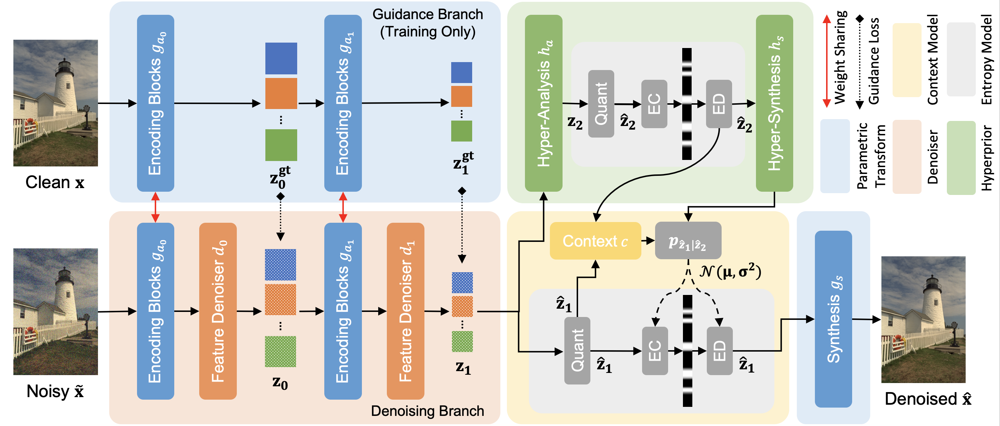

# DenoiseCompression

**Official PyTorch Implementation for [Optimizing Image Compression via Joint Learning with Denoising (ECCV2022)](https://arxiv.org/abs/2207.10869).**




## Introduction
High levels of noise usually exist in today's captured images due to the relatively small sensors equipped in the smartphone cameras, where the noise brings extra challenges to lossy image compression algorithms. Without the capacity to tell the difference between image details and noise, general image compression methods allocate additional bits to explicitly store the undesired image noise during compression and restore the unpleasant noisy image during decompression. Based on the observations, we optimize the image compression algorithm to be noise-aware as joint denoising and compression to resolve the bits misallocation problem. The key is to transform the original noisy images to noise-free bits by eliminating the undesired noise during compression, where the bits are later decompressed as clean images. Specifically, we propose a novel two-branch, weight-sharing architecture with plug-in feature denoisers to allow a simple and effective realization of the goal with little computational cost. Experimental results show that our method gains a significant improvement over the existing baseline methods on both the synthetic and real-world datasets.


## Installation
This repository is developed based on a Linux machine with the following:
* Ubuntu 18.04.3
* NVIDIA-SMI 440.33.01
* Driver Version: 440.33.01
* CUDA Version: 10.2
* GPU: GeForce RTX 2080 Ti

Clone this repository and set up the environment.
```bash
git clone https://github.com/felixcheng97/DenoiseCompression
cd DenoiseCompression/CompressAI
conda create -n decomp python=3.6
conda activate decomp
pip install -U pip && pip install -e .
pip install pyyaml
pip install opencv-python
pip install tensorboard
pip install imagesize
pip install image_slicer
```

## Dataset Preparation
### 1. Synthetic Dataset
The Flicker 2W dataset (or your own data) is used for training and validation. You could download the dataset through this [link](https://drive.google.com/file/d/1EK04NO6o3zbcFv5G-vtPDEkPB1dWblEF/view), which is provided on their official [GitHub](https://github.com/liujiaheng/CompressionData) page. Place the unzipped dataset under the `./data` directory with the following structure:
```
.
`-- data
    |-- flicker
    |   `-- flicker_2W_images
    |       |-- xxx.jpg
    |       |-- ...
    |       `-- xxx.jpg
    `-- SIDD   
```

Then run the following scripts to split the data into training and testing samples. The script also filters out the images with less than $256$ pixels as described in the paper.
```bash
cd codes/scripts
python flicker_process.py
```

### 2. Real-world Dataset
We use the public [SIDD-Medium](https://www.eecs.yorku.ca/~kamel/sidd/dataset.php) dataset for training; we further validate and test on the [SIDD Benchmark](https://www.eecs.yorku.ca/~kamel/sidd/benchmark.php) data. Specifically, you need to download the followings:
* SIDD-Medium Dataset - sRGB images only (~12 GB)
* SIDD Benchmark - SIDD Benchmark Data - Noisy sRGB data
* SIDD Benchmark - SIDD Validation Data and Ground Truth - Noisy sRGB data
* SIDD Benchmark - SIDD Validation Data and Ground Truth - Ground-truth sRGB data
* SIDD Benchmark - SIDD Benchmark Data (full-frame images, 1.84 GB)

After you download all the data, place the unzipped dataset under the `./data` directory and organize them with the following structure:
```
.
`-- data
    |-- flicker
    `-- SIDD  
        |-- SIDD_Benchmark_Data
        |-- SIDD_Benchmark_zips
        |   |-- BenchmarkNoisyBlocksSrgb.mat
        |   |-- ValidationGtBlocksSrgb.mat
        |   `-- ValidationNoisyBlocksSrgb.mat
        `-- SIDD_Medium_Srgb
```

Then run the following scripts to process the data and generate annotations.
```bash
cd codes/scripts
python sidd_block.py
python sidd_tile_annotations.py
```

## Training
To train a model for a specific task, run the following script:
```bash
cd codes
OMP_NUM_THREADS=4 python train.py -opt ./conf/train/<xxx>.yml
```

## Testing
We are going to release our testing scripts, models, and results. Please stay tuned with us.


## Acknowledgement
This repository is built based on [CompressAI](https://github.com/InterDigitalInc/CompressAI).


## Citation
If you find this work useful, please cite our paper:
```
@inproceedings{cheng2022optimizing,
    title     = {Optimizing Image Compression via Joint Learning with Denoising}, 
    author    = {Ka Leong Cheng and Yueqi Xie and Qifeng Chen},
    booktitle = {Proceedings of the European Conference on Computer Vision},
    year      = {2022},
    pages     = {--}
}
```

## Contact
Feel free to open an issue if you have any question. You could also directly contact us through email at klchengad@connect.ust.hk (Ka Leong Cheng) and yxieay@connect.ust.hk (Yueqi Xie).
